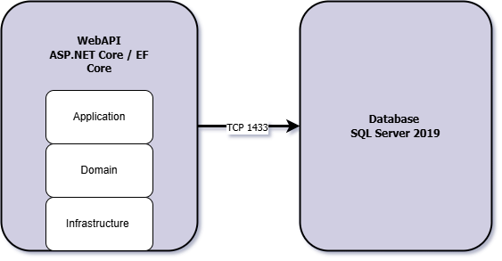

# BusinessManagement - Aplicación ASP.NET Core con DB Contenedorizada

Este proyecto es una aplicación de gestión empresarial (CRUD de clientes, productos, ventas, etc.) construida con:
- ASP.NET Core (aplicando Clean Architecture y principios SOLID)
- EF Core para acceso a datos y migraciones
- SQL Server en contenedor Docker
- Docker Compose para orquestación

El objetivo es demostrar un entorno completamente contenedorizado, con datos de demo (seeding) y fácil despliegue.

## Índice
1. [Arquitectura y Diagrama](#arquitectura-y-diagrama)
2. [Requisitos Previos](#requisitos-previos)
3. [Instrucciones de Ejecución](#instrucciones-de-ejecución)
4. [Uso de la Aplicación](#uso-de-la-aplicación)
5. [Historias y Logros Técnicos](#historias-de-impacto-y-logros-técnicos)
6. [Posibles Mejoras Futuras](#posibles-mejoras-futuras)
7. [Créditos / Referencias](#créditos--referencias)

## Arquitectura y Diagrama

A continuación se muestra la arquitectura en capas y la relación entre contenedores Docker:

- El contenedor `webapi` ejecuta ASP.NET Core y EF Core.
- El contenedor `db` corre SQL Server 2019.
- Docker Compose orquesta ambos contenedores y expone los puertos.

## Requisitos Previos

- **Docker Desktop** (o Docker Engine + Docker Compose) instalado.
- **Git** (para clonar el repositorio localmente).
- .NET SDK 8 (o la versión que este usando) si deseas compilar y correr la app fuera de Docker.

## Instrucciones de Ejecución

1. Clona este repositorio:
   git clone https://github.com/jeancadev/BusinessManagement.git
   cd BusinessManagement

2. Ejecuta Docker Compose:
   docker-compose up --build -d
(Esto compilara la imagen de la WebApi y levantara el contenedor de SQL Server)

3. Verifica contenedores en ejecucion:
   docker-compose ps

4. Accede a la WebApi: http://localhost:8090/swagger
   (Swagger UI para probar los endpoints)

5. Detener la ejecucion:
   docker-compose down

## Uso de la Aplicación (Endpoints y Ejemplos)

## Uso de la Aplicación

La API expone varios endpoints, por ejemplo:

### Obtener todos los productos
GET /api/products

### Crear un producto
POST /api/Products 
Body (JSON): 
{ 
	"name": "Laptop",
	"description": "Dell Inspiron 15",
	"price": 999.99,
	"stock": 10
}

### Obtener un producto por ID
GET /api/Products/{id}

### Actualizar un producto
PUT /api/Products/{id}
Body (JSON):
{
	"name": "Laptop Updated",
	"description": "Dell Inspiron 15 Updated",
	"price": 1099.99,
	"stock": 7
}

### Eliminar un producto
DELETE /api/Products/{id}

### Customers
GET /api/Customers

### Obtener un cliente por ID
GET /api/Customers/{id}

### Crear un cliente
POST /api/Customers
Body (JSON):
{
  "firstName": "Pedro",
  "lastName": "Guzman",
  "email": "pedro@pedro.com"
}

### Actualizar un cliente
PUT /api/Customers/{id}
Body (JSON):
{
  "firstName": "Pedro Updated",
  "lastName": "Guzman Updated",
  "email": "pedro.updated@pedro.com"
}

### Eliminar un cliente
DELETE /api/Customers/{id}

### Sales
GET /api/Sales

### Obtener una venta por ID
GET /api/Sales/{id}

### Crear una venta
POST /api/Sales
Body (JSON):
{
  "customerId": "GUID-del-cliente",
  "saleDate": "2025-03-22T10:00:00",
  "items": [
    {
      "productId": "GUID-del-producto",
      "quantity": 2,
      "unitPrice": 500.00
    }
  ]
}

### Actualizar una venta
PUT /api/Sales/{id}
Body (JSON):
{
  "saleDate": "2025-03-22T10:00:00",
  "items": [
	{
	  "productId": "GUID-del-producto",
	  "quantity": 1,
	  "unitPrice": 800.00
	}
  ]
}

### Eliminar una venta
DELETE /api/Sales/{id}

### Autenticación / Login
POST /api/Auth/Login
Body (JSON):
{
  "username": "admin",
  "password": "1234"
}
-**Nota**: La autenticación es básica y solo valida el usuario "admin" con contraseña "1234" igualmente se puede acceder con el usuario "it" y contraseña "9999" (Esto es solo para demostración)

### Hay un seeding de datos de demo (DbInitializer.cs) que crea algunos productos y clientes iniciales.)

## Historias y Logros Técnicos

- **Contenedorización completa**: Logré empaquetar la WebApi y la DB en contenedores separados, orquestados con Docker Compose, facilitando la instalación y la demo ante reclutadores.
- **Resolución de problemas**: Originalmente, la imagen SQL 2022 daba errores por permisos no-root. Migré a la imagen 2019-latest, documenté el proceso y resolví el conflicto.
- **Arquitectura Limpia y SOLID**: Separé en capas (Domain, Application, Infrastructure, WebApi) para mantener mantenibilidad y testabilidad.
- **Seeding de datos**: Implementé un DbInitializer que inyecta clientes y productos básicos al arrancar. Esto permite que cualquiera pruebe la API sin pasos adicionales.
- **Futuras mejoras**:
  - Añadir un volumen persistente para conservar datos entre reinicios de contenedores.
  - Implementar un pipeline de CI/CD para automatizar la construcción y publicación de imágenes en Docker Hub.

## Posibles Mejoras Futuras

- **Volumen persistente**: Montar `/var/opt/mssql/data` en un volumen para no perder datos.
- **Autenticación JWT**: Si mas adelante se requiere seguridad real, implementar un AuthController con JWT.
- **Despliegue en la nube**: Subir la imagen a Azure Container Registry y ejecutar en un Azure App Service o Kubernetes.
- **Pruebas Unitarias**: Añadir un proyecto `BusinessManagement.Tests` con xUnit para validar la lógica de dominio.

## Créditos / Referencias

- [EF Core Docs](https://learn.microsoft.com/ef/core)
- [Docker Docs](https://docs.docker.com/)
- [SQL Server en contenedores](https://learn.microsoft.com/sql/linux/sql-server-linux-overview)
