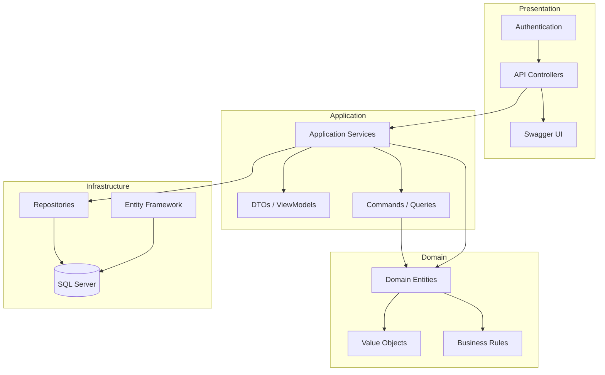

# BusinessManagement - Containerized ASP.NET Core Application


Business management application (CRUD for customers, products, sales, inventory) based on Clean Architecture, Docker containers, and SQL Server. Includes JWT authentication, data seeding, and easy deployment.

---

## Table of Contents
1. [Overview](#overview)
2. [Architecture and Diagram](#architecture-and-diagram)
3. [Prerequisites](#prerequisites)
4. [Installation and Execution](#installation-and-execution)
5. [API Usage](#api-usage)
6. [Testing](#testing)
7. [Future Improvements](#future-improvements)
8. [Credits and References](#credits-and-references)

---

## Overview

- **Framework:** ASP.NET Core 8, Clean Architecture, SOLID
- **Persistence:** EF Core, SQL Server 2019 (Docker container)
- **Orchestration:** Docker Compose
- **Authentication:** Basic (demo users)
- **Seeding:** Sample data for immediate testing

Image available on [Docker Hub](https://hub.docker.com/repository/docker/26jeanca/businessmanagement-webapi/general)

---

## Architecture and Diagram

The project follows the principles of Clean Architecture, organizing the code into layers with specific responsibilities and maintaining dependencies towards the center of the diagram:



### Layer Description

1. **Presentation Layer**
   - REST API Controllers
   - Filters and Middleware
   - Basic Authentication
   - Swagger Documentation

2. **Application Layer**
   - Application Services
   - DTOs and ViewModels
   - Commands
   - Queries
   - AutoMapper Mappings

3. **Domain Layer**
   - Core Entities (Customer, Product, Sale, etc.)
   - Value Objects
   - Business Rules
   - Repository Interfaces

4. **Infrastructure Layer**
   - Repository Implementations
   - EF Core Context
   - Migrations
   - SQL Server Configuration

### Data Flow
1. HTTP requests arrive at the controllers
2. Controllers use application services
3. Services implement business logic using entities
4. Repositories persist data in SQL Server
5. Responses are mapped to DTOs and returned to the client

---

## Prerequisites

- **Docker Desktop** (or Docker Engine + Docker Compose)
- **Git**
- **.NET SDK 8** (only if you want to compile outside Docker)

---

## Installation and Execution

1. Clone the repository:
   ```sh
   git clone https://github.com/jeancadev/BusinessManagement.git
   cd BusinessManagement
   ```
2. Build and start the containers:
   ```sh
   docker-compose up --build -d
   ```
3. Verify the containers:
   ```sh
   docker-compose ps
   ```
4. Access the API: [http://localhost:8090/swagger](http://localhost:8090/swagger)
5. Stop the execution:
   ```sh
   docker-compose down
   ```

---

## API Usage

### Authentication
- User: `admin` / Password: `1234`
- User: `it` / Password: `9999`

### Main Endpoints

#### Products
- `GET    /api/Products` — List products
- `POST   /api/Products` — Create product
- `GET    /api/Products/{id}` — Get product
- `PUT    /api/Products/{id}` — Update product
- `DELETE /api/Products/{id}` — Delete product

#### Customers
- `GET    /api/Customers` — List customers
- `POST   /api/Customers` — Create customer
- `GET    /api/Customers/{id}` — Get customer
- `PUT    /api/Customers/{id}` — Update customer
- `DELETE /api/Customers/{id}` — Delete customer

#### Sales
- `GET    /api/Sales` — List sales
- `POST   /api/Sales` — Create sale
- `GET    /api/Sales/{id}` — Get sale
- `PUT    /api/Sales/{id}` — Update sale
- `DELETE /api/Sales/{id}` — Delete sale

#### Example: Create Product
```json
POST /api/Products
{
  "name": "Laptop",
  "description": "Dell Inspiron 15",
  "price": 999.99,
  "stock": 10
}
```

#### Example: Create Customer
```json
POST /api/Customers
{
  "firstName": "Peter",
  "lastName": "Guzman",
  "email": "peter@peter.com"
}
```

#### Example: Create Sale
```json
POST /api/Sales
{
  "customerId": "GUID-of-the-customer",
  "saleDate": "2025-03-22T10:00:00",
  "items": [
    {
      "productId": "GUID-of-the-product",
      "quantity": 2,
      "unitPrice": 500.00
    }
  ]
}
```

---

## Testing

- The project includes unit tests in `BusinessManagement.UnitTests`.
- To run them locally:
  ```sh
  dotnet test BusinessManagement.UnitTests/BusinessManagement.UnitTests.csproj
  ```

---

## Future Improvements

- Persistent volume for SQL Server
- Deployment to Azure/Kubernetes
- More test coverage

---

## Credits and References

- [EF Core Docs](https://learn.microsoft.com/ef/core)
- [Docker Docs](https://docs.docker.com/)
- [SQL Server on containers](https://learn.microsoft.com/sql/linux/sql-server-linux-overview)
